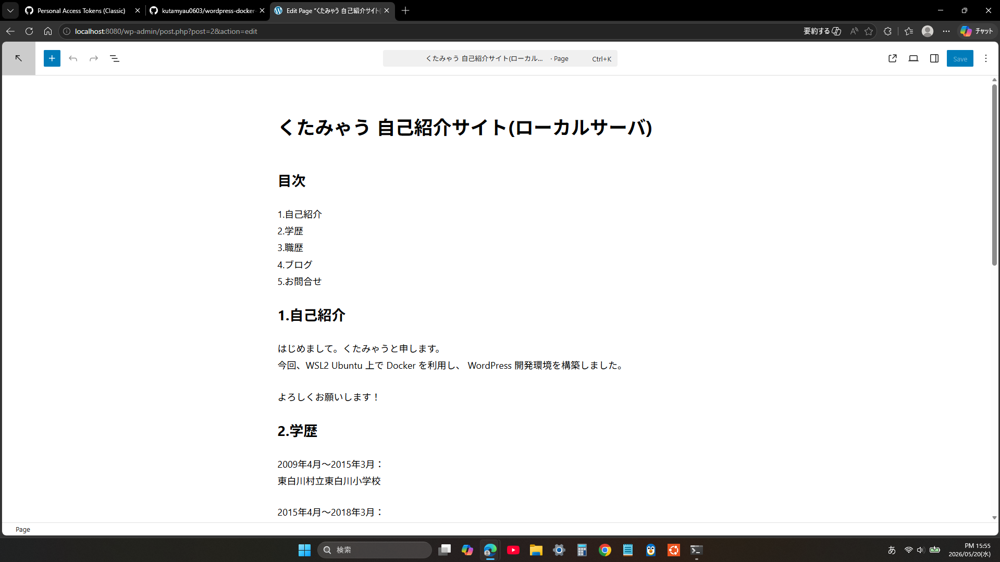

# WordPress Docker Environment

## スクリーンショット

## 概要
WSL2 Ubuntu 上で Docker を利用し、
WordPress 開発環境を構築しました。

## 使用技術
- WSL2
- Ubuntu
- Docker
- Docker Compose
- WordPress
- MySQL

## 起動方法
docker compose up -d

## 停止方法
docker compose down

## 工夫した点
- Docker Compose による環境構築
- データ永続化
- WSL2 上で Linux 環境を構築

## 学んだこと
- Docker の基本操作
- Linux コマンド
- Git/GitHub の利用
